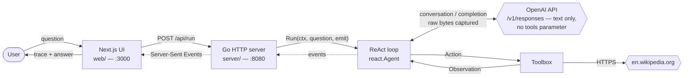
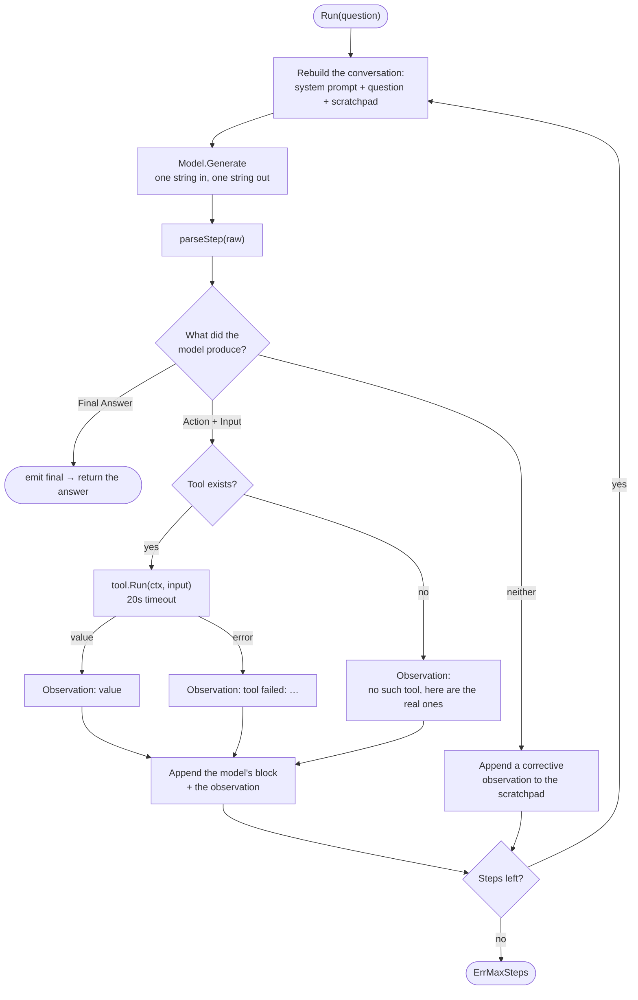
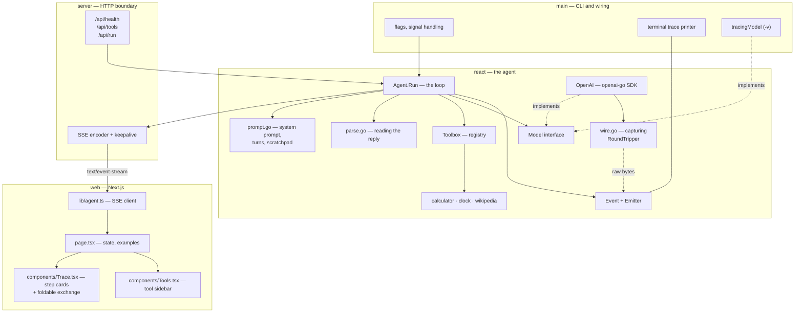
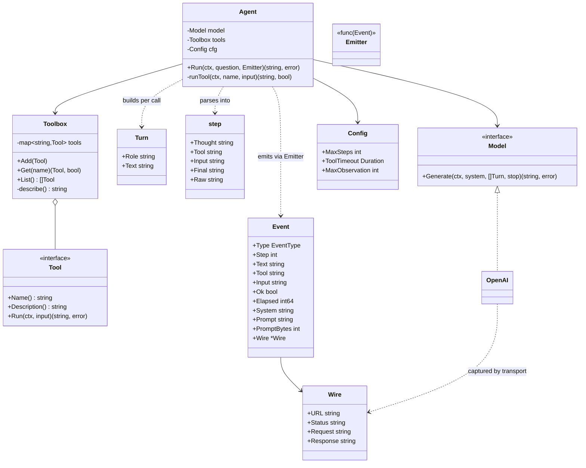
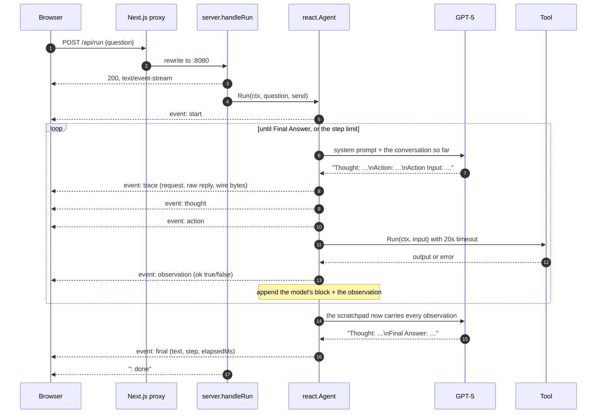
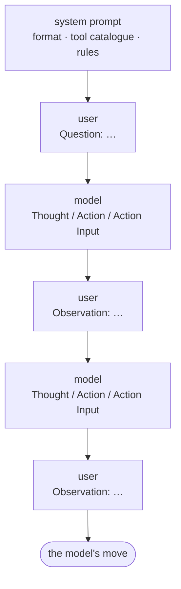
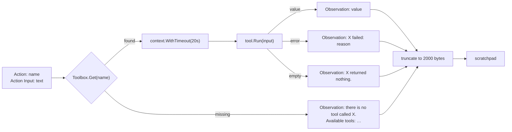
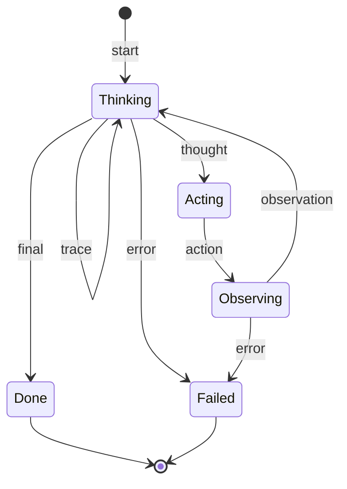
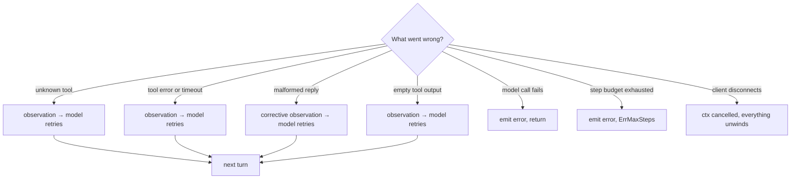
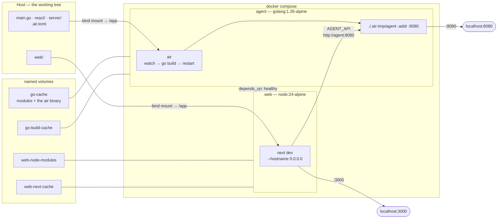

# ReAct agent — design

A demo of the **ReAct** pattern, built to show how an agent harness works at
the level where nothing is hidden. A language model answers a question by
alternating between reasoning in prose and calling tools; the loop, the tool
protocol and the parser are all in this repository, and the provider is used as
a plain text-completion endpoint. The model is GPT-5, and the trace of every
step — thought, action, observation, and the raw HTTP exchange behind each — is
streamed live to a Next.js UI.

The provider has a native tool-calling interface, and this demo deliberately
does not use it. §12 records what that trade costs, measured both ways.

This document explains the architecture and the reasoning behind it. For usage
and flags see [`README.md`](README.md).

---

## 1. Requirements and scope

| Requirement | How it is met |
|---|---|
| Show how an agent harness works | `react.Agent.Run` is the whole loop: prompt, parse, run a tool, append, repeat — no framework, no provider tool API |
| Ground answers in real data | Three tools — arithmetic, a clock, Wikipedia — supply facts the model must not invent |
| Make the reasoning visible | Every stage of the loop is emitted as an event and streamed to the browser as it happens |
| Survive a sloppy model | Bad formats, unknown tools and tool failures are recoverable inside the loop, not fatal |
| Be testable without an API key | The model sits behind a one-method interface; the tests drive the whole loop with a script |
| Run from a terminal too | The same agent backs `go run . -q "…"` and the HTTP server |

Explicitly **out** of scope: multi-turn chat (each question is an independent
run), authentication, and persistence.

The tool protocol is our own, not the provider's. Tools are described to the
model in the system prompt, it asks for them in text, and this package parses
that text and runs them. Sending a `tools` array instead would be fewer lines
and fewer failure modes — and would move the interesting part behind an API
boundary, which is the opposite of the point here. §12 has the numbers from
running it both ways.

---

## 2. System context



The dotted path is the interesting one. The agent reports progress through a
callback rather than returning only a final string, so the UI can render each
step while the run is still going. A four-step run takes five to ten seconds;
without streaming, that is five to ten seconds of nothing.

---

## 3. The loop



Three properties of this shape matter more than the code itself.

**The model never writes an Observation.** Every fact in the transcript is
something the Go process actually did. A model left alone will write its own
tool output and then reason over fiction, and it reads exactly like a real
trace.

Where that is enforced is worth being precise about, because it is the part
people assume the API handles. A stop sequence on `"\nObservation:"` would halt
generation the moment the model tried — but GPT-5 rejects the `stop` parameter
outright, so the agent asks for it, the provider ignores it, and `parseStep`
carries the guarantee alone: it discards everything from a model-written
`Observation:` onwards, so the text never reaches the scratchpad and can never
be re-sent as though it had happened.

This is the part of the design most sensitive to the protocol. A JSON envelope
(§12) would remove the channel entirely — there would be no field for the model
to write a tool result into — which is the strongest argument for that change.

**The loop is stateless.** Each call rebuilds the system prompt, the question
and every completed round; nothing is retained between calls but a slice of
`padEntry`. A run is fully described by what it sends, which makes it
inspectable (`-v` prints it), reproducible and trivial to resume or replay. The
cost is quadratic growth, bounded by the step limit and observation truncation.

**Every failure is an observation.** A missing tool, a syntax error in an
expression, an HTTP timeout, even a reply the parser cannot read — each becomes
text appended to the scratchpad. The model reads it on the next step and adapts.
That is the difference between a demo that falls over on the first surprise and
one that recovers.

## 4. Components



The type surface is deliberately small:



`Model` has exactly one method because that is all the loop needs: a system
prompt, the conversation, a stop sequence — one string back. The provider is
never told that tools exist. Everything
provider-specific — API key, model name, reasoning effort, the mapping from
`Turn` to chat roles, the capturing transport — lives in `react/openai.go` and
`react/wire.go` and is invisible to `Agent`. The tests
substitute a `scriptedModel` that replays canned completions, so the loop, the
parser, the recovery paths, the conversation shape and the event sequence are
all covered with no network and no key.

---

## 5. A request, end to end



The browser is talking to one origin the whole time: `next.config.mjs` rewrites
`/api/*` to the Go server, so there is no CORS preflight on the streaming
request. The server also sets permissive CORS headers for the case where you
point the UI straight at `:8080`, and sends `X-Accel-Buffering: no` plus a
comment heartbeat every 15 seconds so no intermediary decides an idle-looking
response is dead.

`http.Server` is configured with `ReadHeaderTimeout` but deliberately **no**
`WriteTimeout`: an SSE run is a long-lived response, and a write deadline would
sever a slow agent mid-thought.

---

## 6. The prompt contract

The system prompt states the format, the tool catalogue and the rules. The
catalogue is the *entire* interface between the model and the toolbox — three
lines of prose, rendered from `Toolbox.describe()` and sorted so the prompt is
byte-identical between runs:

```
Available tools:
- calculator: Evaluate an arithmetic expression. Input is the expression alone, e.g. …
- clock: Get the current date and time. Input is an optional IANA timezone …
- wikipedia: Look something up in English Wikipedia. Input is a search phrase …
```

Nothing is registered with the provider and nothing is validated for us.
Whether the model picks the right tool, and hands it something usable, depends
entirely on how well those sentences are written — which is why each names its
input format and gives an example.

The rest of the request is a conversation, rebuilt from the scratchpad on every
call: the agent speaking as the user, the model's own blocks returned to it in
the model role.



The roles are the point. A chat model is post-trained on alternating turns, and
replaying its previous blocks as *user* text means it never sees its own words
as its own. Measured on a weaker model over eight runs of four questions, real
turns cut the two drift symptoms this demo suffers from — a reply with no
`Thought` line (13% of steps → 3%) and a block that both acts and answers, which
makes the parser skip the tool (17% → 6%).

Two details are load-bearing. A model turn is the block *rebuilt from the
parse*, not the raw reply, so fences, preambles and hallucinated observations
are not replayed and reinforced. And every user turn ends with a one-line
reminder of the format: dropping it once produced a run of eight steps that
emitted no `Thought` at all and then hit the step limit.

Models drift from any format you give them, and a malformed block costs a whole
round trip to correct. So `parseStep` is lenient by design — it repairs what it
can and only gives up on real ambiguity:

| The model does this | The parser does this |
|---|---|
| Wraps the block in ``` fences | Strips them |
| Writes a prose preamble, then the block | Keeps the last `Thought:` that has an `Action` after it |
| Writes its own `Observation:` anyway | Truncates everything from that line on — it is fiction |
| `Action Input: {"query": "Ada Lovelace"}` | Unwraps the JSON object by known key, or by the only key |
| `Action Input: "Asia/Tokyo"` | Unquotes the JSON string |
| Emits both an Action and a Final Answer | Takes the Final Answer |
| Answers in bare prose, no keywords | Treats the whole reply as the final answer |
| Emits a Thought and then stops | Appends a corrective observation and asks again |

That last row is the only path that spends a step without doing any work, which
is why it is the fallback rather than the first response to an unexpected shape.

This table *is* the cost of owning the protocol. Almost all of it would be
deleted by asking the provider to return a fixed JSON envelope instead —
measured, with what survives and what does not, in §12.

The row above it is a real fork, not an oversight: taking the Final Answer means
a model that announces a lookup and answers in the same block never runs the
tool, and answers from memory. Preferring the `Action` would trade that for an
extra step.

Generation settings (`react/openai.go`):

| Setting | Value | Why |
|---|---|---|
| `reasoning.effort` | `low` | the scratchpad carries the reasoning between steps; a run pays for hidden reasoning once per step |
| `max_output_tokens` | 4096 | reasoning tokens come from the same budget |
| `temperature` | *unset* | `Only the default (1) value is supported` |
| `stop` | *sent, ignored* | `'stop' is not supported with this model`; see §3 |

No `reasoning.summary` either: the model's own `Thought:` line is the visible
reasoning here, so a provider-generated précis would be a second one.

One wart worth knowing, found by running it: GPT-5 frequently returns *two*
message items — a conversational preamble, then the block — and the SDK's
`OutputText()` joins them with no separator, producing
`…Asia/Tokyo.Thought: I need…`. The binding joins message parts with a newline
itself, and the parser drops the preamble.

## 7. Tools

| Tool | Input | Why a model needs it |
|---|---|---|
| `calculator` | an arithmetic expression, evaluated by `expr-lang` | models decide *what* to compute far better than they compute it |
| `clock` | an optional IANA timezone | a model's only notion of "today" comes from its training data |
| `wikipedia` | a search phrase | facts that should be looked up rather than recalled |

The three are not arbitrary: they cover the three reasons a ReAct loop reaches
for a tool at all — compute something, read ambient state, fetch external
knowledge.



Two details that are easy to get wrong:

- **Tool errors are written for the model to read.** `cannot evaluate "1 +* 2": unexpected token` tells it what to fix; a Go error chain would not. Nothing validates the input before it arrives, so this is the *only* feedback channel a tool has.
- **Observations are truncated before they re-enter the prompt.** Tool output is re-sent on every subsequent turn, so an unbounded observation grows the context quadratically — one chatty tool would blow the budget by step four.

`wikipedia` is two calls — search, then the lead section of the best hit — and
returns the runner-up titles so the model can retry with a narrower query
instead of giving up. It reads the lead through `action=query&prop=extracts`
rather than the REST summary endpoint, which looks equivalent and is not: REST
strips the parenthetical that opens most biographies, so "Rudolf Emil Kálmán
(May 19, 1930 – July 2, 2016)" arrives without the dates. An agent asked how old
someone would be then cannot finish. Against a confabulating model that surfaces
as a confident wrong answer; against GPT-5 it surfaced as a run that spent its
whole step budget rephrasing the same query. Same missing fact, two different
symptoms, neither of them obviously a tool bug. Responses are capped at 1 MiB and carry a `User-Agent`, as
Wikipedia's API requires.

Adding a tool is `react.NewTool(name, description, fn)` plus a line in
`DefaultToolbox`. There is nothing else to wire up, because the description *is*
the interface: it is the only thing the model reads when deciding whether to
call it, so it names the input format and gives an example.

---

## 8. Events and streaming

The agent's whole output contract with the outside world is
`Emitter func(Event)`:

| Type | When | Carries |
|---|---|---|
| `start` | run begins | the question, the system instruction |
| `trace` | model replied, before parsing | `step`, the request as a role-labelled transcript (`prompt`), the raw reply, the HTTP exchange (`wire`), `elapsedMs`, `promptBytes` |
| `thought` | model reasoned | `step`, text |
| `action` | model chose a tool | `step`, `tool`, `input` |
| `observation` | tool returned | `step`, `tool`, text, `ok`, `elapsedMs` |
| `final` | answer produced | `step`, text, `elapsedMs` |
| `error` | run stopped early | message, `elapsedMs` |



`trace` is the odd one out: every other event is the agent's *interpretation* of
what the model said, and `trace` is what it actually said. Shipping both lets a
viewer audit the parser — a hallucinated observation that got truncated, a
preamble that got dropped, a block the parser had to reject — instead of taking
the tidied version on faith. With the protocol living in this repository rather
than behind an API, that audit is the difference between understanding the
harness and trusting it. Shipping both lets a
viewer audit the parser — a hallucinated observation that got truncated, a block
the parser had to reject, an `Action` the model buried in prose — instead of
taking the tidied version on faith. It also makes the central claim of §3 something
you can check rather than believe: open the request at step 3 and the whole
scratchpad is there, every observation written by the Go process, none by the
model.

The system instruction is identical on every turn, so it travels once on the
`start` event and the UI rejoins it to each step's prompt; only the growing half
is sent per step. `promptBytes` covers both halves, because watching it climb is
the clearest illustration of what a stateless scratchpad costs.

Below even that sits `wire`: the exact JSON posted to
`generativelanguage.googleapis.com` and the exact JSON that came back, captured
by an `http.RoundTripper` the OpenAI client is built with
(`react/wire.go`). Nothing about it is reconstructed, which is the point — the
reconstruction is what the rest of the package already shows. It is also where
`reasoning_effort`, `max_completion_tokens` and the response's `finish_reason`
and `usage` — including `reasoning_tokens` and `cached_tokens` — become visible,
none of which exist anywhere in the parsed view.

Capture is bounded at 64 KiB per half, which the request half will reach first
since it carries the whole conversation.

Two consequences are worth stating plainly. The captured bytes go to the
browser, so the transport redacts the API key from the URL and from both bodies,
and a test asserts it (`TestCaptureRedactsTheAPIKey`); the key travels in an
`Authorization: Bearer` header, which is never captured at all. And the request
text is deliberately carried twice — once as `prompt`, once inside
`wire.request` — because a `Model` that never speaks HTTP still has a prompt
worth reading, and only the HTTP one has bytes.

The same event stream feeds two very different renderers, which is the test that
the abstraction is at the right level: `printEvent` in `main.go` colours it for a
terminal, and `groupSteps` in `web/app/components/Trace.tsx` folds it into
per-step cards for the browser. Neither knows anything about the other.

Each card is the parsed reasoning, then a full-width section underneath holding
the exchange that produced it: one fold control and three tabs — `request`,
`response`, and `raw` when there are bytes to show. Folded, which is the
default, the section costs one line per step. The fold is a single state for all
three tabs, because they are three readings of one exchange rather than three
independent panels, and picking a tab opens the section, so the tab strip is the
way in as well as the way between.

That section went through two earlier shapes, and what it cost to get here is
the lesson. It began as a right-hand column, which gave a 4 kB prompt 260 px to
live in and turned it into an unreadable ribbon; then it measured the space it
had and folded only the overflow, which was a neat trick that solved the wrong
problem. The material is wide — prompts are documents, JSON is wide — so the fix
was to stop budgeting width for it and give it the whole card.

On the wire each event is one SSE frame — `event: <type>` plus a JSON `data:`
line — and the client in `web/app/lib/agent.ts` parses the stream by hand rather
than using `EventSource`, because the question travels in a POST body and
`EventSource` is GET-only. Frames are split on the blank-line boundary with a
partial frame held in a buffer, and an unparseable frame is skipped rather than
killing the run.

Cancellation propagates the whole way: the UI's `AbortController` aborts the
fetch, which closes the connection, which cancels `r.Context()`, which cancels
the in-flight model call and any running tool. Ctrl-C does the same thing to a
terminal run via `signal.NotifyContext`.

---

## 9. Failure handling



Only two things end a run unhappily: the model provider itself failing, and the
step budget running out. Everything else is information the model gets to act
on. The default budget is 8 steps — enough for the three-tool chains this demo
produces, low enough that a model stuck in a loop costs seconds, not minutes.

---

## 10. Configuration

| Knob | Where | Default | Why that default |
|---|---|---|---|
| `OPEN_API_KEY` | env | — | required; the only secret (`OPENAI_API_KEY` also accepted) |
| `OPENAI_MODEL` | env | `gpt-5` | the model the demo is written against |
| `-q` | flag | — | one-shot terminal run; omit to serve |
| `-addr` | flag | `:8080` | matches the UI's proxy target |
| `-max-steps` | flag | 8 | covers observed chains with headroom |
| `-web` | flag | `web/out` | serves a static export if present, API-only if not |
| `-v` | flag | off | prints the conversation sent and the reply received — the debugging tool for prompt work |
| `ToolTimeout` | `react.Config` | 20s | one slow tool must not hold the stream open |
| `MaxObservation` | `react.Config` | 2000 bytes | bounds quadratic growth of the request |
| `NO_COLOR` | env | — | honoured, along with a TTY check |

The model's own parameters — `reasoning.effort`, `max_output_tokens`, and the
settings GPT-5 refuses — are in §6 rather than here, because they are properties
of the provider rather than knobs of the agent.

---

## 11. Testing

`go test ./react/` runs the entire loop with no key and no network, because
`Model` is one method and `scriptedModel` replays a list of replies while
recording every conversation and tool declaration it was sent. The assertions are about behaviour
that would otherwise only show up in production:

*The loop:*

- a tool result actually reaches the next call (`Observation: 42` appears in request #2);
- the event sequence is exactly `start → trace → thought → action → observation → trace → final`;
- an unknown tool and a failing tool each put a readable explanation in front of the model;
- the step limit returns `ErrMaxSteps` rather than looping;
- the trace event carries the request, the system instruction and a prompt size that grows from step to step.

*The conversation (§6):*

- roles strictly alternate, and the question is the first user turn;
- a model turn is the canonical rebuilt block — a hallucinated `Observation: 999` in the raw reply never re-enters the conversation;
- a malformed reply goes back as the model's own text, paired with the correction;
- the system prompt actually lists every tool in the box, since that catalogue is the model's only documentation.

*The parser:* eight shapes — fenced blocks, JSON-object and quoted inputs, a
hallucinated observation, a prose preamble, bare prose, an action, a final
answer — parse the way the table in §6 claims. This is the largest group of
tests in the package, and that is the honest cost of owning the protocol.

*Recovery:* an unknown tool, a failing tool and a reply the parser cannot read
each put an explanation in front of the model rather than ending the run.

*The wire (§8):* the API key never survives into the captured URL, request or
response, and the response body is still intact for the SDK after being read.
That one is not a nicety — those bytes are sent to a browser.

The tools themselves are tested directly where they are deterministic
(`sqrt(pow(3,2) + pow(4,2))` → `5`, an unknown timezone → error). `wikipedia` is
not asserted against the live encyclopedia; its contract is the `Tool` interface,
which the loop tests already exercise through the others.

---

## 12. Trade-offs and what would change at scale

| Decision | Bought | Cost | When to revisit |
|---|---|---|---|
| Text protocol, not native function calling | Every mechanism is visible and provider-independent; the reasoning is the model's own words | 206 lines of parser, and drift to repair | If the demo becomes a product, the structured-output middle path below is the first move, not `tools` |
| Stateless conversation, rebuilt per call | Inspectable, replayable, no hidden state | Request grows quadratically | Past ~15 steps, summarise old rounds instead of resending them |
| Calls run in the order the model asks for them | Simple, and the trace reads in order | Two independent lookups in one reply still run one after the other | Run the calls in a reply concurrently; they are already independent |
| One run per request | No session store, no auth | No follow-up questions | Add a conversation id and keep the scratchpad server-side |
| Trace streamed, tokens not | Structured events the UI can group | The pause inside a step is silent | `Chat.Completions.NewStreaming` would let thoughts type out live |
| Observation truncation at 2000 bytes | Bounded cost | A long article gets cut, and lead sections are longer than the summaries this tool used to return (§7) | Chunk and let the model ask for more |

### Prefix caching, measured

Splitting the request into turns is sometimes proposed as a way to earn prefix
cache hits. It is not what earns them, and the reason is worth recording so the
question does not get re-litigated: caching matches on the *token prefix*, and
this request has always been append-only, so the same tokens are shared whether
they arrive as one block or as ten turns. Structure was never the variable.

The variable is the floor, and it is provider-specific. Against
`gemini-3.6-flash`, implicit caching needed 4,096 input tokens; a six-step run
peaked at 1,262 and no response carried a cached-token field at all — the cache
never engaged once. Against `gpt-5` the floor is lower, and the same suite
reports real hits: over eight runs and 41 steps on the Responses API, 9,856 of
33,144 input tokens came back as `cached_tokens` — about 30%. Nothing about the
agent was changed to earn that. The request simply crossed a threshold.

The cost lever that is *not* provider-specific is the quadratic re-send: a
six-step run bills several times its unique content because every observation is
re-sent on every later step. Tightening `MaxObservation`, or dropping an
observation once the model has used it, saves more than any restructuring. The
turn split was still worth doing — see §6 — but for format adherence, not for
cost.

There is a second, quieter cost this provider adds: hidden reasoning. At
`effort: low`, 41 steps spent 4,480 reasoning tokens. The `summary: auto`
setting buys back a readable précis of them — that is what fills the Thought
rows — but the tokens themselves are billed as output and never appear in any
trace, and they are the one part of the exchange the `raw` tab cannot show you
the content of.

### Text protocol vs native calling, measured

This demo has now been run both ways. The same eight-run suite:

| | text protocol | native calling |
|---|---|---|
| steps | 28 | 41 |
| tool calls | 20 | 35 |
| runs that never answered | 0 / 8 | 1 / 8 |
| input tokens billed | 20,342 | 33,144 |
| served from cache | 3,072 | 9,856 |
| steps with visible reasoning | 28 / 28 | 30 / 41 |
| replies that invented an Observation | 2 / 28, both discarded by the parser | not possible |
| parser code to maintain | 206 lines (127 of code), 8 shapes | none |

The text-protocol column is from the current implementation on the Responses
API; the native column from the same suite when this demo used `tools`. The
invented-observation row is the one to dwell on: it happens, roughly once every
fifteen steps, and the only thing standing between it and an answer built on
fiction is four lines in `parseStep`.

Native calling cost more on every axis except caching and parser code. Two
reasons, and neither is a defect in that protocol. Its instruction told the
model not to guess a number it could compute, so it called `calculator` for
arithmetic it used to do inline — grounding working as asked, bought at the
price of a round trip. And reasoning was visible on 30 of 41 steps rather than
all of them, because a summary is something the provider chooses to emit and a
`Thought:` line is something we demand.

What native calling buys is not in the table: arguments validated before they
reach a tool, a result the model has no channel to forge, and no parser. What it
costs is also not in the table, and is why this demo went back: the mechanism
moves behind an API boundary. With the text protocol you can read the exact
bytes that make the model call a tool, and change them. Drift does not
disappear either way — under native calling it moved into the argument values,
where a schema cannot see it: the API returned `{"query":"Rudolf E. K\u001alman"}`,
a schema-valid string containing a corrupted escape.

Whether that trade is worth 13 extra steps depends on whether you are building
an agent or explaining one. This repository is explaining one.

The nearest useful additions, in order: a `search` tool so the agent is not
limited to Wikipedia's index, token-level streaming inside a step, and a
`final_answer` pseudo-tool so termination is an explicit action rather than a
parsed keyword.

---

### Structured output: the middle path, measured

There is an option between parsing prose and handing the protocol to the
provider, and it is the one to reach for first if this demo ever became a
product: keep our protocol, but let the provider guarantee the *envelope*.
`text.format: {type: "json_schema", strict: true}` on the Responses API — no
`tools` parameter, so the loop stays ours — and each step comes back as:

```json
{"thought":"I need the current time in Tokyo…","action":"clock","action_input":"Asia/Tokyo","final_answer":null}
```

Probed against `gpt-5`, that worked first time, and so did the round trip:
feeding `Observation: …` back as a user turn produced a well-formed step with
`action: null` and the answer filled in.

**What it would delete.** Most of `parse.go`:

| today | with a schema |
|---|---|
| `parseActionInput` — 32 lines guessing between bare text, quoted strings, `{"query": …}` and `{"expression": …}` | gone; `action_input` is a typed field |
| four regexes, `stripFences`, `clean` | gone; one `json.Unmarshal` |
| the `Observation:` truncation | **gone** — a fixed schema gives the model no field to write a tool result into, so the channel §3 worries about stops existing |
| the Action-vs-Final-Answer fork | survives as an explicit field check, or moves into the schema as an `anyOf` of two variants, which makes the provider enforce the exclusivity |

**What it does not fix.** The probe came back as *two* message parts, each a
complete, schema-valid step — and the second one began "I have the current Tokyo
time" for a tool call that had never run. The schema constrains the shape of
each object. It says nothing about how many objects arrive, or whether they are
honest. Something like `trimPreamble` survives, as "take the first object, not
the last".

That is the third costume the same problem has worn in this repository:
free-text format drift, then a schema-valid `{"query":"Rudolf E. K\u001alman"}`
under native calling, now a schema-valid step that assumes a result it never
received. It is why §3's third property — every failure is an observation — is
the one that has survived every protocol change here, and why no amount of
envelope validation removes the need for it.

**What it costs.** The schema is re-sent every step (162 input tokens in the
probe against 120 for the comparable prose setup); multi-line thoughts arrive
JSON-escaped, so the raw trace reads worse than `Thought:` blocks do; and
constrained decoding is reported to dent reasoning quality slightly on some
tasks, which is not something this demo can measure honestly.

For a product: take it. For a document that exists to show the mechanism, it is
a genuine toss-up — 206 lines of visible parser traded for a schema the provider
enforces where you cannot watch it.

---

## 13. Development environment

The stack runs as two containers that execute the working tree directly — no
image is built for either service. A stock `golang:1.26-alpine` and a stock
`node:24-alpine` get the source bind-mounted in and run it, so the edit-to-
running-code path has no build step in it at all.



Four details carry the arrangement:

- **Polling, not inotify.** Bind mounts on macOS and Windows do not deliver
  filesystem events into a Linux container, so air is configured with
  `poll = true` and Next.js with `WATCHPACK_POLLING`. Without this, nothing
  reloads and the cause is invisible — the watcher is running, it simply never
  hears anything.
- **`node_modules` and `.next` are container-side volumes**, masking the host
  directories. The host's `node_modules` was installed for darwin, and Next's
  native binaries are platform-specific; mounting them into Linux breaks the
  dev server in a confusing way.
- **Caches survive restarts.** `GOPATH` and the Go build cache live in named
  volumes, so `go install air@latest` happens once and later starts are
  immediate.
- **The UI waits for a healthy API**, not merely a started container: the
  `agent` healthcheck polls `/api/health`, which only answers once air's first
  build has finished, and `web` has `depends_on: service_healthy`.

Measured on this machine: a `.go` edit is serving new behaviour ~2s later, and
a `.tsx` edit the same. `send_interrupt` with a 2s `kill_delay` lets the old
process drain its open SSE streams instead of cutting a run mid-thought.
